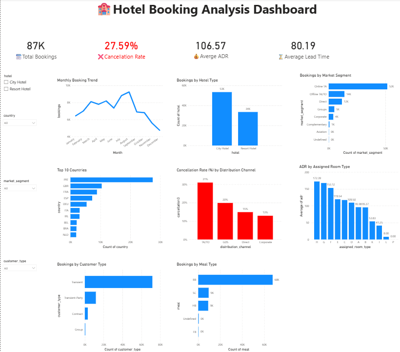

#  Hotel Booking Analysis

##  Project Overview

This project analyzes hotel booking data to identify booking trends, customer behaviour, cancellation patterns, and hotel performance. SQL was used to answer business questions, Power BI was used to build an interactive dashboard, and Python (Pandas) was used to validate the analysis.

##  Dashboard Preview

##  Objectives

- Analyze hotel booking trends.
- Identify cancellation patterns.
- Compare hotel performance.
- Analyze customer segments and distribution channels.
- Build an interactive dashboard for business decision-making.

## Tools & Technologies

- Microsoft Excel
- SQL
- Power BI
- Power Query
- Python (Pandas)

##  Dataset

The dataset contains hotel booking information including:

- Hotel
- Country
- Market Segment
- Distribution Channel
- Customer Type
- Meal
- Assigned Room Type
- Arrival Month
- Average Daily Rate (ADR)
- Lead Time
- Cancellation Status

After data cleaning, the final dataset contains **87,396** records.

##  Business Questions Answered

1. Which hotel has the highest number of bookings?
2. What is the overall cancellation rate?
3. Which month has the highest bookings?
4. Which country has the highest bookings?
5. Which hotel has the highest Average Daily Rate (ADR)?
6. Which hotel has the highest cancellation rate?
7. Which market segment has the highest bookings?
8. Which market segment has the highest cancellation rate?
9. Which customer type has the highest bookings?
10. Which assigned room type has the highest ADR?
11. Which distribution channel has the highest bookings?
12. Which distribution channel has the highest cancellation rate?
13. Which meal type is most preferred?
14. Which meal type has the highest cancellation rate?
15. Which hotel has the highest average lead time?

## Dashboard Features

- KPI Cards
- Booking Trends
- Cancellation Analysis
- ADR Analysis
- Lead Time Analysis
- Customer Type Analysis
- Market Segment Analysis
- Distribution Channel Analysis
- Interactive Filters (Slicers)

##  Key Insights

- City Hotel recorded the highest number of bookings.
- Overall cancellation rate is approximately **27.59%**.
- August recorded the highest number of bookings.
- Portugal (PRT) generated the highest number of bookings.
- City Hotel recorded the highest Average Daily Rate (ADR).
- Online Travel Agencies generated the highest number of bookings.
- Transient customers accounted for the majority of bookings.
- TA/TO was the leading distribution channel.
- BB was the most preferred meal type.
- Resort Hotel recorded the highest average lead time.

##  Project Files

- Hotel Booking Analysis.pbix
- hotel_cleaned.csv
- SQL Queries.sql
- Hotel_Booking_Analysis.py
- Dashboard.png
- Hotel Booking Analysis Report.pdf

##  Author

**Sumeet Chauhan**

BCA Graduate | SQL | Power BI | Python | Excel

If you found this project useful, feel free to explore the repository and connect with me.